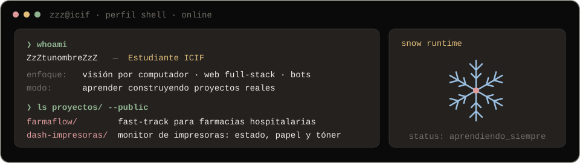
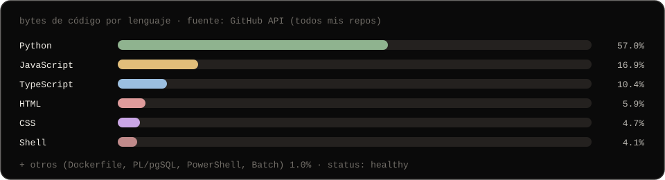

 

---

## `$ whoami`

  

 

## `$ cat tech-stack.yaml`

<table>
  <thead>
    <tr>
      <th colspan="2" align="left"><code>zzz@icif:~$ cat tech-stack.yaml</code></th>
    </tr>
  </thead>
  <tbody>
    <tr>
      <td width="50%" valign="top"><code>├─ ✦ lenguajes:</code>  
         
        <code>Python · TypeScript · JavaScript · SQL · HTML · CSS · Bash · PowerShell</code>
      </td>
      <td width="50%" valign="top"><code>├─ ▣ frontend:</code>  
        
         
        <code>React · Next.js · Vite · Tailwind · React Router · Zustand · Recharts</code>
      </td>
    </tr>
    <tr>
      <td valign="top"><code>├─ ⚙ backend:</code>  
        
        
         
        <code>Node.js · Express · FastAPI · Socket.IO · JWT · Helmet</code>
      </td>
      <td valign="top"><code>├─ ▤ datos:</code>  
         
        <code>Supabase · PostgreSQL · Redis · SQLite</code>
      </td>
    </tr>
    <tr>
      <td valign="top"><code>├─ ◉ vision_automatizacion:</code>  
        
        
        
         
        <code>OpenCV · Ultralytics YOLO · NumPy · PyAutoGUI · Puppeteer · Scapy</code>
      </td>
      <td valign="top"><code>├─ ♪ bots:</code>  
        
         
        <code>discord.js · discord.py · whatsapp-web.js</code>
      </td>
    </tr>
    <tr>
      <td valign="top"><code>├─ ✓ testing_calidad:</code>  
        
        
         
        <code>Vitest · Testing Library · ESLint · Ruff</code>
      </td>
      <td valign="top"><code>╰─ ⌁ devops:</code>  
        
         
        <code>Docker · Compose · systemd · GitHub Actions · Git · esbuild</code>
      </td>
    </tr>
  </tbody>
  <tfoot>
    <tr>
      <td colspan="2"><code>status: aprendiendo&nbsp;&nbsp;·&nbsp;&nbsp;environment: icif</code></td>
    </tr>
  </tfoot>
</table>

---

## `$ git ls-files | lang-stats`

  

