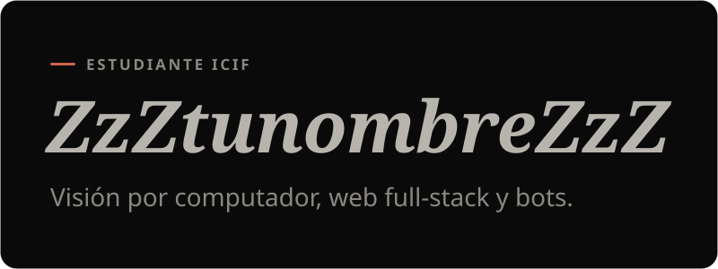

 

### En qué trabajo

- **Visión por computador** — captura de cámaras y detección local con OpenCV y YOLO.
- **Web full-stack** — React, Next.js, FastAPI y Supabase.
- **Bots y automatización** — Discord, WhatsApp y Puppeteer.

### Proyectos públicos

- **[Farmaflow](https://github.com/ZzZtunombreZzZ/Farmaflow)** — fast-track para farmacias hospitalarias.
- **[Dash-impresoras](https://github.com/ZzZtunombreZzZ/Dash-impresoras)** — estado, papel y tóner de impresoras en tiempo real.

### Stack

<samp>Python · TypeScript · SQL · React · Next.js · Tailwind · FastAPI · Express · Supabase · PostgreSQL · Redis · OpenCV · YOLO · Docker · GitHub Actions</samp>
